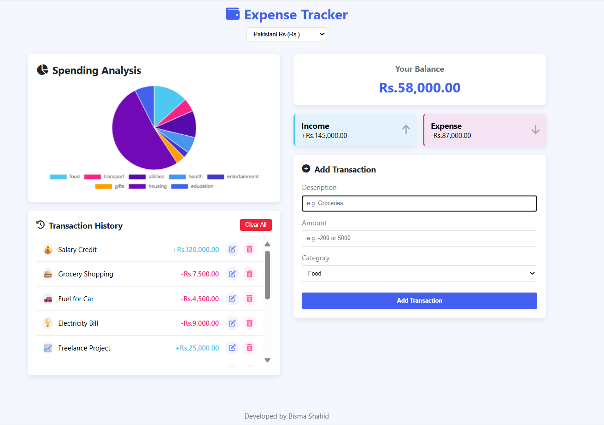

# 💰 Expense Tracker Web Application  

A responsive, browser-based **personal finance management system** built with **HTML, CSS, JavaScript, and Chart.js**. It allows users to **track income & expenses**, categorize spending, switch currencies, and visualize data with an interactive pie chart. All data is saved in **LocalStorage** for persistence.  

---
## Preview

---

## Overview  

This Expense Tracker app is designed to simplify money management by offering:  

- A **clean and responsive interface**.  
- **Real-time balance updates**.  
- **Income & expense tracking** with categories.  
- **Spending analysis** through a dynamic pie chart.  
- **Multi-currency support** for global usage.  
- **LocalStorage integration** to save transactions even after page refresh.  

---

## Key Features  

✅ **Add, Edit, Delete Transactions** – Manage income & expenses seamlessly.  
✅ **Categorize Spending** – Food, Transport, Shopping, Health, etc.  
✅ **Multi-Currency Support** – PKR, USD, EUR, GBP, and more.  
✅ **Spending Analysis Chart** – Visual breakdown of expenses by category.  
✅ **Transaction History** – View and manage all your past records.  
✅ **Clear All Transactions** – Reset with a single click.  
✅ **Data Persistence** – Saves all data in the browser’s LocalStorage.  
✅ **Modern UI** – Styled with clean layouts and icons for better UX.  

---

##  Try it out now

https://bisma-404.github.io/Expense-Tracker/

---

## How to Run  

1. **Clone or Download** this repository  
2. Simply **run `index.html`** in your browser  

---

## Future Improvements  

- Dark mode theme  
- Cloud sync support (Google Drive/Dropbox)  
- User authentication for multi-device access  
- Export transactions as CSV/PDF  
- Monthly budget & savings goals  

---

## License  

This project is for academic and institutional use. Please credit the developers if reused or modified for deployment.  

---

## Developed By  

**Bisma Shahid**  
Department of Software Engineering  
FAST NUCES Karachi  
   
